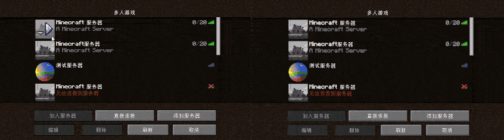

# KnapsackToGo4
强大的跨服数据同步插件第4代。

可在多个服务器之间同步玩家数据，支持多种同步方式。

使用KnapsackToGo4可以轻松的完成多服务器之间的数据同步。

# 支持的同步方式
- 文件
- mysql
- sqlite

#  如何保证数据安全
KnapsackToGo4使用的独占锁的方式，当玩家在一个服务器中的时其他服务器无法读取。

下面是两个mc客户端登录同一个游戏账号进入安装了KnapsackToGo4并且互相同步的服务器的演示。

# 为什么写这款插件
KnapsackToGo2插件已经有很多服务器在使用了，并且功能也挺完善。
但是仍然存在一些问题，例如：服务器崩溃后玩家再次进入服务器就需要等待许久。
我自己对KnapsackToGo2也是不满意的，
在开发完KnapsackToGo2之后我又继续开发了许多插件，也学习到了很多编程经验，我感觉我的编程技术有了很大的进步。
在总结了前几代插件的毛病和逻辑上的问题后，我想到了一种新的方案。于是我决定重新编写了一个更好的KnapsackToGo4。
这次全新的KnapsackToGo4是在总结了前面所有失败的经验后完全重新编写的，运行逻辑也是最合理符合直觉的。

ps：
为什么新一代叫KnapsackToGo4而不是KnapsackToGo3呢?
因为KnapsackToGo3在很久之前就写完了，但是因为问题太多所以就弃坑了。

## 相较于KnapsackToGo2的提升
 - 拥有更多同步方式
 - 更强大的扩展性
 - 解决了服务器崩溃死锁的问题

# 名词定义
#### 数据容器
存储数据的方式。用来存数据。比如记录文字可以用纸和笔，也可以用电脑或手机，还可以刻在石头上。
#### 数据序列化
加载和保存数据的方式。比如你可以用汉语表达信息，也可以用英语表达信息。

# 使用方法
## 注意
请认真读完注意事项，避免发生数据丢失。

PlayerDataCase.yml和PlayerDataSerialize.yml请在开服之前配置好后就不要再修改，否则会丢失数据。

PlayerDataCase.yml是数据容器，也就是存储数据的方式。一旦设置好后就不要修改了。

PlayerDataSerialize.yml是数据序列化，是表示数据的方式。一旦设置好后就不要修改了。

如果使用了数据容器类扩展PlayerDataCase.yml将无效。插件在识别到扩展的情况下不会生成PlayerDataCase.yml文件，说明安装成功。例如安装了MongoDB数据库的扩展，请删除PlayerDataCase.yml配置文件。

如果使用了数据序列化类扩展PlayerDataSerialize.yml文件将无效。插件在识别到扩展的情况下不会生成PlayerDataSerialize.yml文件，说明安装成功。例如安装了NBT序列化的扩展，请删除PlayerDataSerialize.yml配置文件。

如果需要你的服务器已经有许多的玩家数据了，请不要安装或者删除如何扩展。因为很有可能造成数据丢失。

请尽量在插件第一次加载时就将所以扩展安装好，插件在识别到数据容器类扩展的情况下不会生成PlayerDataCase.yml文件，在识别到数据序列化扩展的情况下不会生成PlayerDataSerialize.yml文件。

如果在开发环境，需要修改PlayerDataSerialize.yml或者安装或删除序列化类扩展，请先清除数据容器中的全部数据。使用的文件就删除文件，使用的数据库就删除表。

## 关于配置文件

### 核心配置文件
lang.yml、playerDataConfig.yml和ServerConfig.yml是插件核心逻辑的配置文件。这三个配置保持默认就行，一般不需要修改。
- lang.yml 语言文件
- playerDataConfig.yml 玩家数据管理配置
- ServerConfig.yml 服务器配置

playerDataConfig.yml
~~~yaml
玩家数据加载前保持背包为空: false  #在数据同步加载之前清空玩家背包，不建议开启。
玩家数据解锁检测间隙: 5  #如果玩家数据被其他服务器上锁，那么多久去看一下是否被解锁。这个操作是在异步的，不会卡服务器。
自动保存时间: 600 #自动保存玩家数据，防止服务器突然崩溃数据没保存。
~~~

ServerConfig.yml
~~~yaml
serverName: null  #没什么用，就是好看
~~~

### 其他配置文件
- PlayerDataCase.yml 选择序列数据容器的配置文件
- PlayerDataSerialize.yml  选择数据序列化方法的配置文件

为什么不是核心配置文件？

PlayerDataCase.yml是告诉插件要注册什么数据容器，其实容器类扩展的功能就是注册自己的数据容器，所以在有扩展的时候不会生成PlayerDataCase.yml配置文件。

PlayerDataSerialize.yml是告诉插件要注册什么序列化方法，其实序列化扩展就是注册自己的序列化方法，所以在有扩展的时候就不会生成PlayerDataSerialize.yml配置文件。

目前插件有三种数据容器，一种序列化方法。
#### 容器列表
- File 用文件的方法存储数据
- Sqlite 一款轻型的数据库，储存在单一文件中的一个完整的数据库，无需安装和管理配置。
- Mysql 一款轻量级数据库，通过网络连接。
#### 序列化方法列表
- Yaml

PlayerDataCase.yml
~~~yaml
playerDataCaseType: Mysql  #填上方的其中一种就行了
~~~

PlayerDataSerialize.yml
~~~yaml
playerDataSerializeType: Yaml  #填上方的其中一种就行了
~~~

为什么需要这两个文件？

因为插件里自带了多种数据容器和序列化方法，所以需要这两个文件来告诉插件你要用哪一个。

为什么安装相应的扩展就不需对应的文件了？

因为安装扩展就相当于已经选择扩展作为数据容器或序列化方法了，所以自然不需要了。

### 插件自带的数据容器的配置文件
#### File
FileDataCaseSetUp.yml
~~~yaml
file: <文件位置>  #这里填写数据保存到的文件夹路径
~~~
#### Sqlite
MysqlDataCaseSetUp.yml
~~~yaml
userName: root #用户名
PassWord: 778899& #密码
dataBaseURL: jdbc:mysql://127.0.0.1/KnapsackToGo4 #数据库URL
holdLockTime: 30000 #持有锁时间，数值越小数据库更新越频繁，但是服务器崩溃后自解锁越快。如果服务器基本不崩溃可以适当地设置长一点。但是设置太长了服务器如果突然崩溃就要等很久。
~~~
#### Mysql
SqliteDataCaseSetUp.yml
~~~yaml
userName: root #用户名
PassWord: 778899& #密码
dataBaseURL: jdbc:sqlite:C://knapsackToGo4/playerData.db #数据库URL
holdLockTime: 30000 #持有锁时间，数值越小数据库更新越频繁，但是服务器崩溃后自解锁越快。如果服务器基本不崩溃可以适当地设置长一点。但是设置太长了服务器如果突然崩溃就要等很久。
~~~

### 插件自带的序列化方法的配置文件
#### Yaml
YamlDataSerializeSetUp.yml
~~~yaml
AdvancementProgress: false #进度
EnderChest: true #末影箱
Experience: true #经验
FoodLevel: true #饱食度
Health: true #血量
Inventory: true #物品栏
PotionEffects: true #药水效果
~~~
### 扩展的配置文件
扩展也会生成相应的配置文件，也许在KnapsackToGo4的文件夹中，也可能在扩展插件对应的文件夹中。去参考扩展的文档配置。