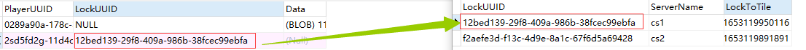

# 常见问题解答
## 一直显示正在加载数据，并且读数。
2022.07.19.0949版本之前提示消息是：正在加载你的数据,请稍等...

2022.07.19.0949版本之后提示消息是：等待其他服务器保存数据...

### 产生原因
为了保证数据安全，一个玩家的数据在同一时间只允许被一个服务器加载。
服务器在加载数据之后会给这个数据打上一个标记，
当其他服务器读取这个数据的时候如果发现存在这个标记就会等待，
直到标记被清除后才会读取。

### 解决方法
这个问题通常只有在保存数据时发生错误才会产生，如果是使用文件，或者是sqlite这种本地数据库，发生概率非常小。
就算是使用mysql只要网络连接良好，通常也不会产生此问题。

**如果你的服务器上发生了此问题，请一定要保留日志并提交给我。在后续的更新中或许此问题将不会存在了。**

注意：在处理问题之前需要先确认玩家是否同登录两个相同的账号连接不同的两个服务器，如果是这种情况，那就是正常的无需处理。

#### 使用file数据容器的解决方法
file数据容器，是使用操作系统的文件锁。在数据被锁时会生成两个锁文件，分别是<玩家uuid>.lock,<玩家uuid>.lock.inf.

<玩家uuid>.lock是锁标记文件

<玩家uuid>.lock.inf是锁信息

如果你在FileDataCaseSetUp.yaml中设置了每个服务器的serverName那么排查起来就相当方便了。
你可以用记事本打开<玩家uuid>.lock.inf就可以看到是哪个服务器锁定了这个玩家数据，只需重启这个服务器即可。
如果你所有服务器都是默认值null那么请重启所有服务器吧！

#### 使用mysql或者sqlite数据库的解决方法
数据库使用的是关系方式加锁，数据库中有两个表分别是playerdata和lockserver。

服务器会在启动时在lockserver里添加一条随机的LockUUID，关闭时删除这条LockUUID。如果你发现lockserver中的信息条数多于在线服务器数量，那么说明你服务器非正常关闭了，导致锁残留在表里。你可以在所有服务器都关闭的情况下清空这个表。

lockserver中的LockToTime是锁到期时间，在线的服务器会在到期之前自动续期。如果时间到期就会认为此锁已经失效。

playerdata的LockUUID是指向lockserver的LockUUID的，如下图所示。

如果你在mysqlCaseSetUp.yaml中或sqliteCaseSetUp.yaml设置了每个服务器的serverName那么，这样就可以找到玩家是被什么服务器锁了。

如果确定了这个玩家没有在这个服务器中，只用修改这个玩家的LockUUID为”NULL“即可为这个玩家解锁。

